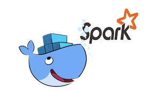

<html>
<head>
  <meta charset="utf-8">
  <meta http-equiv="X-UA-Compatible" content="IE=edge,chrome=1">
  <link rel="stylesheet" href="stylesheets/stylesheet.css" media="screen">
  
  
  
  <link rel="stylesheet" href="stylesheets/github-dark.css">
  <meta name="viewport" content="width=device-width, initial-scale=1, user-scalable=no">
  <title>Docker image for spark-notebook</title>
</head>
<body>
 

      <header>
        <h1 style="color:green;align="right";>Docker image for spark-notebook</h1>
        
Spark, spark-notebook projects.

<h1 id="idtitle1">
      </header>

<h1 id="idtitle1">
<a id="i-what-is-this" class="anchor" href="#i-what-is-this" aria-hidden="true"></a>I. What is this?</h1>

Docker images based on Jessie for spark-notebook quick start.

 <h1 id="idtitle2">
<a id="ii-how-to-use-it" class="anchor" href="#ii-how-to-use-it" aria-hidden="true"></a>II. How to use it?</h1>
<li style="display: inline;" >
<a href="https://github.com/StackDevit/Spark-Projects/zipball/master">Download <strong>ZIP File</strong></a></li>
<li style="display: inline;" >
<a href="https://github.com/StackDevit/Spark-Projects/tarball/master">Download <strong>TAR Ball</strong></a></li>
<li style="display: inline;" >
<a href="https://github.com/StackDevit/Spark-Projects">View On <strong>GitHub</strong></a></li></ul>

<h1 id="idtitle4">
<a id="iv-issues-and-contributing" class="anchor" href="#iv-issues-and-contributing" aria-hidden="true"></a>III. Issues and Contributing</h1> 
<h2><a id="iv1-support" class="anchor" href="#iv1-support" aria-hidden="true"></a>III.1/ Support</h2>

If you are having issues, please let me know.

<h2><a id="iv2-contribute" class="anchor" href="#iv2-contribute" aria-hidden="true"></a>III.2/ Contribute</h2>

Bug reports, bug fixes, and new features are always welcome. 

</li>
<li>Issue Tracker: <a href="https://github.com/NajlaBH/BigData/issues">github</a> 
</li>
<li>Source Code: <a href="https://github.com/NajlaBH/BigData/pulls">github</a>
<h2 id="idtitleE">
<a id="iv3-authors-and-maintainers" class="anchor" href="#iv3-authors-and-maintainers" aria-hidden="true">
</a>III.3/ Authors and Maintainers</h2>

NajlaBH-BigData Projects.
 copyright2017© 

</li>
</ul> 
 

<aside style='float:right; font:bold; color:navy; align:center; font-size:small; border: 1.5px solid; border-radius:20px; width:200px;'>
 
Topics 
<a href="#idtitle1">I. What is this?</a>
 
<a href="#idtitle2">II. How to use it?</a>
 
<a href="#idtitle4">III. Issues and Contributing</a>
</aside>

</article>

Hosted on GitHub Pages &mdash; Theme by <a href="https://github.com/orderedlist">orderedlist</a>

</footer>
 
</html>
